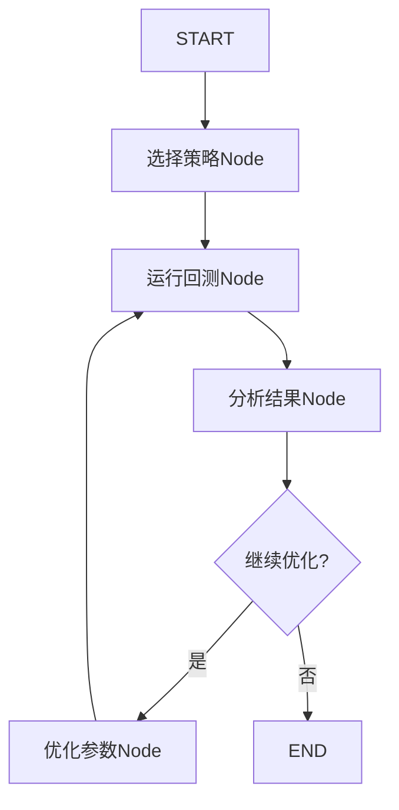

# 🤖 AI策略优化Agent使用指南

## 🎯 功能概述

基于NOFX的设计理念，我们实现了一个**自主策略优化Agent**，它能够：

1. ✅ 自动选择适合当前市场的策略（RSI/MACD/布林带/波动收割/趋势突破）
2. ✅ 使用OKX真实历史数据进行回测
3. ✅ 使用LLM分析回测结果
4. ✅ 自主优化策略参数
5. ✅ 循环迭代直到达到满意的效果
6. ✅ 支持与Agent对话，询问策略逻辑

---

## 📁 文件结构

```
AI_Invest_Assistant/
├── backend/
│   ├── strategies/                    # 策略模块
│   │   ├── __init__.py
│   │   ├── strategy_base.py          # 策略基类
│   │   ├── rsi_strategy.py           # RSI超买超卖策略
│   │   ├── macd_strategy.py          # MACD金叉死叉策略
│   │   ├── bb_strategy.py            # 布林带均值回归策略
│   │   ├── volatility_harvest_strategy.py  # ⭐ 波动收割策略（ATR）
│   │   ├── trend_breakout_strategy.py      # ⭐ 趋势突破策略（线性回归）
│   │   └── backtest_engine.py        # 回测引擎
│   │
│   ├── trading/                       # ⭐ 交易管理模块
│   │   ├── strategy_arena.py         # 策略竞技场（多策略实时对比）
│   │   └── arena_persistence.py      # 竞技场状态持久化
│   │
│   ├── agents/
│   │   ├── crypto_analyst.py         # 加密货币分析Agent
│   │   └── strategy_agent.py         # 策略优化Agent
│   │
│   └── utils/
│       └── logger.py                  # 集中日志管理
│
└── frontend/
    └── streamlit_app.py               # Streamlit应用（含策略优化页面）
```

---

## 🚀 快速开始

### 1. 启动Streamlit界面

```bash
cd AI_Invest_Assistant
streamlit run frontend/streamlit_app.py
```

### 2. 进入"📉 策略回测"页面

在左侧菜单选择"📉 策略回测"

### 3. 配置参数

- **交易对**: BTC-USDT / ETH-USDT / SOL-USDT
- **时间周期**: 1H（推荐）/ 4H / 1D
- **LLM选择**: ✅ 使用DeepSeek（便宜）或通义千问

### 4. 启动Agent

点击"🚀 启动Agent优化"，Agent会自动：

```
🔍 选择策略 → 📊 运行回测 → 🔍 分析结果 → ⚙️ 优化参数 → 🔄 循环
```

### 5. 查看结果

Agent完成后会显示：
- 📊 最终策略和参数
- 📈 回测表现（收益率、夏普比率、最大回撤、胜率）
- 📊 优化历史（每次迭代的表现）

### 6. 与Agent对话

在"💬 与策略Agent对话"区域提问，例如：
- "为什么选择RSI策略而不是MACD？"
- "如何进一步优化参数？"
- "这个策略在熊市表现如何？"

---

## 📊 可用策略详解

### 1️⃣ RSI超买超卖策略

**核心逻辑**:
- RSI < 30 → 买入（超卖反弹）
- RSI > 70 → 卖出（超买回调）

**默认参数**:
```python
{
    'rsi_period': 14,
    'oversold_threshold': 30,
    'overbought_threshold': 70
}
```

**适用场景**: 震荡市、横盘整理
**历史胜率**: 60-70%

---

### 2️⃣ MACD金叉死叉策略

**核心逻辑**:
- MACD上穿信号线 → 买入（金叉）
- MACD下穿信号线 → 卖出（死叉）

**默认参数**:
```python
{
    'fast_period': 12,
    'slow_period': 26,
    'signal_period': 9
}
```

**适用场景**: 趋势市、单边行情
**历史胜率**: 55-65%（趋势市）

---

### 3️⃣ 布林带均值回归策略

**核心逻辑**:
- 价格触及下轨 → 买入（超卖）
- 价格触及上轨 → 卖出（超买）

**默认参数**:
```python
{
    'bb_period': 20,
    'bb_std': 2.0
}
```

**适用场景**: 震荡市、区间交易
**历史胜率**: 65-75%

---

### 4️⃣ 波动收割策略（新增）

**核心逻辑**:
- 使用ATR（平均真实波幅）识别市场波动状态
- 在波动性确认时入场（ATR > 阈值）
- 使用动态移动止损保护利润

**默认参数**:
```python
{
    'atr_period': 20,           # ATR计算周期
    'atr_trail_period': 185,    # 移动止损ATR周期
    'atr_multiplier': 4.5,      # 移动止损ATR倍数
    'stop_loss_pct': 3.0,       # 止损百分比
    'profit_target_pct': 1.3    # 止盈百分比
}
```

**适用场景**: 高波动市场（如BTC）、4H时间周期
**策略特点**: 趋势跟踪为主，动态止损保护利润

---

### 5️⃣ 趋势突破策略（新增）

**核心逻辑**:
- 使用线性回归判断趋势方向
- 使用BiggestRange指标计算波动范围
- 在价格突破关键水平时入场

**默认参数**:
```python
{
    'linreg_period': 102,       # 线性回归周期
    'price_entry_mult': 0.5,    # 入场价格乘数
    'biggest_range_period': 157,# BiggestRange周期
    'bars_valid': 6,            # 入场有效K线数
    'profit_target_pct': 1.6,   # 止盈百分比
    'stop_loss_pct': 2.0        # 止损百分比
}
```

**适用场景**: 趋势明确的市场、4H时间周期
**策略特点**: 突破确认入场，适合单边行情

---

## 🏟️ 策略竞技场（新增）

策略竞技场是一个多策略实时交易对比系统，可以同时运行5种策略进行实盘验证：

**功能特点**:
- 账户资金分为10份，5种策略各分配1份（共50%）
- 前三种策略（RSI/MACD/BB）由Agent控制参数
- 后两种策略（波动收割/趋势突破）使用固定参数
- 实时监控各策略表现并记录交易
- 支持状态持久化和断点续跑

**使用方式**:
```python
from backend.trading.strategy_arena import StrategyArena

arena = StrategyArena(symbol="BTC-USDT", timeframe="4H")
arena.start()
```

---

## 🔬 LangGraph工作流设计

基于NOFX的Multi-Agent架构，我们使用LangGraph构建了自主优化流程：



### State定义

```python
class StrategyAgentState(TypedDict):
    symbol: str                      # 交易对
    timeframe: str                   # 时间周期
    current_strategy: str            # 当前策略
    current_params: dict             # 当前参数
    backtest_result: dict            # 回测结果
    optimization_history: List[dict] # 优化历史
    iteration: int                   # 迭代次数
    messages: Annotated[list, add_messages]
    should_continue: bool            # 是否继续
```

---

## 🧪 命令行测试

也可以直接在命令行运行Agent：

```python
# 进入项目目录
cd AI_Invest_Assistant/backend/agents

# 运行Agent
python strategy_agent.py
```

**输出示例**:
```
=========================================================
🚀 策略优化Agent启动
交易对: BTC-USDT | 时间周期: 1H
=========================================================

策略选择 [迭代 1]
选择策略: RSI, 参数: {'rsi_period': 14, 'oversold_threshold': 30, 'overbought_threshold': 70}

运行回测...
收益率: 12.34%, 夏普: 1.25, 回撤: -5.67%

分析结果...
分析: 策略表现良好，但可以尝试调整RSI阈值以提高胜率。建议继续优化。

🔄 继续优化...

优化参数...
新参数: {'rsi_period': 12, 'oversold_threshold': 28, 'overbought_threshold': 72}

...（重复迭代）...

🎯 优化完成！

=========================================================
📈 最终优化结果
=========================================================
策略: RSI
参数: {'rsi_period': 10, 'oversold_threshold': 25, 'overbought_threshold': 75}
总迭代次数: 4

最终表现:
  总收益率: 18.92%
  夏普比率: 1.87
  最大回撤: -4.23%
  胜率: 72.50%
```

---

## 📚 API接口

### 策略基类

```python
from backend.strategies import RSIStrategy, MACDStrategy, BollingerBandsStrategy

# 创建策略
strategy = RSIStrategy(params={'rsi_period': 14})

# 生成信号
df_with_signals = strategy.generate_signals(df)

# 计算持仓和收益
df_result = strategy.calculate_positions(df_with_signals, initial_capital=10000)
```

### 回测引擎

```python
from backend.strategies import BacktestEngine, RSIStrategy

# 创建回测引擎
engine = BacktestEngine(initial_capital=10000, commission=0.001)

# 创建策略
strategy = RSIStrategy()

# 运行回测
result = engine.run_backtest(strategy, df)

# 获取指标
metrics = result['metrics']
print(f"总收益率: {metrics['total_return_pct']:.2f}%")
print(f"夏普比率: {metrics['sharpe_ratio']:.2f}")
```

### 策略Agent

```python
from backend.agents.strategy_agent import StrategyAgent

# 创建Agent
agent = StrategyAgent(use_deepseek=True)

# 运行优化
result = agent.run(symbol="BTC-USDT", timeframe="1H")

# 获取结果
print(result['current_strategy'])
print(result['current_params'])
print(result['backtest_result']['metrics'])
```

---

## ⚙️ 环境配置

确保`.env`文件包含以下配置：

```bash
# OKX API（必需）
OKX_API_KEY=your_okx_api_key
OKX_SECRET_KEY=your_okx_secret_key
OKX_PASSPHRASE=your_okx_passphrase
OKX_DEMO_TRADING=1  # 1=模拟盘，0=实盘

# LLM API（至少配置一个）
DEEPSEEK_API_KEY=sk-xxxxxxxxxxxxx  # 推荐：便宜
DASHSCOPE_API_KEY=sk-xxxxxxxxxxxxx  # 通义千问
```

---

## 🎯 与NOFX的对比

| 特性 | NOFX | 我们的实现 |
|------|------|-----------|
| 语言 | Go + TypeScript | Python |
| 策略类型 | 需要Prompt工程 | 代码化策略（RSI/MACD/BB） |
| 回测引擎 | 内置 | ✅ 自研简易引擎 |
| Multi-Agent | ✅ AI竞争模式 | ✅ LangGraph自主优化 |
| 参数优化 | 手动调整 | ✅ Agent自主优化 |
| 交易所 | Binance/Hyperliquid | OKX（可扩展） |
| 可视化 | React Dashboard | Streamlit |
| 对话功能 | ❌ 无 | ✅ 与Agent对话 |

---

## 🔥 下一步扩展

### Week 2-3: 高级策略
- [ ] 网格交易策略
- [ ] 马丁格尔策略
- [ ] 多策略组合（Portfolio）

### Week 4-5: 风险管理
- [ ] 止损止盈
- [ ] 仓位管理（Kelly公式）
- [ ] 风险控制Agent

### Week 6-8: 生产化
- [ ] WebSocket实时交易
- [ ] Telegram通知
- [ ] Docker部署
- [ ] 策略市场（分享策略）

---

## 📖 参考资料

- [NOFX GitHub](https://github.com/NoFxAiOS/nofx)
- [LangGraph官方文档](https://langchain-ai.github.io/langgraph/)
- [OKX API文档](https://www.okx.com/docs-v5/zh/)
- [量化策略研究](https://medium.com/@boyangchen02/backtesting-a-stochastic-rsi-macd-cryptocurrency-trading-strategy-using-python-9f880abf52e6)

---

## 🆘 常见问题

### Q: Agent运行很慢？
**A**: 
1. 使用DeepSeek而不是GPT-4（便宜且快）
2. 减少K线数量（limit=100而不是300）
3. 限制迭代次数（修改iteration < 3）

### Q: 回测结果不准确？
**A**: 
1. 确保使用足够的历史数据（至少100条K线）
2. 手续费已经考虑（默认0.1%）
3. 注意滑点（未实现，可以扩展）

### Q: 如何添加自己的策略？
**A**:
```python
# 1. 继承BaseStrategy
from backend.strategies.strategy_base import BaseStrategy

class MyStrategy(BaseStrategy):
    def __init__(self, params: dict = None):
        super().__init__(name="我的策略", params=params or {})
    
    def generate_signals(self, df: pd.DataFrame) -> pd.DataFrame:
        # 实现你的信号逻辑
        df['signal'] = 0  # 0=持有, 1=买入, -1=卖出
        return df
    
    def get_strategy_description(self) -> str:
        return "策略说明"

# 2. 在StrategyAgent中注册
self.available_strategies['MyStrategy'] = MyStrategy
```

### Q: 如何切换到实盘？
**A**: ⚠️ **极度危险！充分测试后再考虑！**
1. 修改`.env`: `OKX_DEMO_TRADING=0`
2. 添加风险控制（止损、仓位限制）
3. 从小资金开始（$50-100）

---

## ✅ 完成检查清单

- [ ] 能够启动Streamlit界面
- [ ] 能够运行Agent并看到优化过程
- [ ] 能够查看回测结果
- [ ] 能够与Agent对话
- [ ] 理解LangGraph工作流
- [ ] 能够修改策略参数
- [ ] 准备好讲解项目（面试）

**恭喜！你现在拥有一个基于LangGraph的自主策略优化系统！** 🎉

根据你的60天计划，这已经完成了：
- ✅ Week 1-2: Agent核心能力（LangGraph + Multi-Agent）
- ✅ Week 3-4: 回测系统（策略 + 回测引擎）
- ✅ 前端界面（策略展示 + Agent对话）

继续前进吧！🚀
